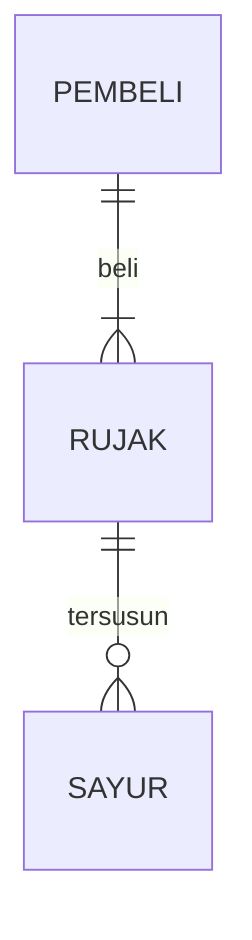

## 1.1 Latar Belakang

    Penyandang disabilitas seringkali menghadapi kesulitan dalam berkomunikasi dan mengakses informasi, terutama jika mereka memiliki disabilitas sensorik atau kesulitan berbicara. Aksesibilitas komunikasi adalah hak asasi manusia yang penting, dan aplikasi seperti "Dishelper" sangat dibutuhkan untuk memberikan alat bantu yang dapat membantu memecahkan masalah ini.
    Dishelper adalah sebuah aplikasi yang dirancang untuk memberikan alat bantu dan dukungan teknologi kepada kaum disabilitas. Aplikasi ini bertujuan untuk mengatasi berbagai hambatan komunikasi yang dihadapi oleh penyandang disabilitas, seperti disabilitas sensorik atau kesulitan berbicara, dengan memberikan solusi berbasis teknologi, terutama berfokus pada fitur text-to-speech (TTS) dan voice-to-text (VTT), serta alat bantu lainnya.

## 1.2. Deksripsi Teknologi Informasi

    Teknologi Informasi (TI) adalah sebuah konsep yang merujuk pada penggunaan berbagai jenis teknologi, termasuk perangkat keras (hardware), perangkat lunak (software), jaringan komunikasi, dan sistem informasi, untuk mengumpulkan, menyimpan, mengelola, memproses, dan mentransmisikan data dan informasi dalam berbagai konteks bisnis dan pribadi.
    Adapun Teknologi informasi yang digunakan dalam aplikasi ini:
    1. Alat Bantu Komunikasi
        Teknologi Informasi digunakan untuk mengintegrasikan alat bantu             komunikasi seperti text-to-speech (TTS) dan voice-to-text (VTT).
    2. 

## 1.3. Branding

- Merk    : DisHelper
- Tagline : Ada untuk membantu
- Campaign: Bagaimana membuat aplikasi yang dapat membantu dan merangkul mereka yang memiliki kekurangan fisik dalam beraktifitas dan berkomunikasi.
  
Target user:
- Usia 7+
- Seorang yang memiliki disabilitas sensorik atau kesulitan berbicara.
- Seorang yang membutuhkan alat bantu komunikasi portable.
- Seorang yang memerlukan informasi sarana ramah disabilitas.

User experience theme:
- Mudah
- Sederhana
- Warna: light blue / light yellow
Inspirasi desain:

## 2. User Story

bla | bla | bla | bla
---|---|---|---
bla | bla | bla | ⭐⭐⭐⭐⭐

## 3. Struktur Data

Cara membuat aneka macam bentuk grafik menggunakan mermaid.js bisa lihat di [https://mermaid.js.org/syntax/entityRelationshipDiagram.html](https://mermaid.js.org/syntax/entityRelationshipDiagram.html) 

## 4. Arsitektur Sistem

Masih pake mermaid.js juga bisa lihat flowchart di [https://mermaid.js.org/syntax/flowchart.html](https://mermaid.js.org/syntax/flowchart.html)

## 5. Teknologi, Library, dan Framework

bla bla bla

## 6. Desain User Experience dan User Interface

Bisa load image 

## 7. Demonstrasi Video

Link youtube nya

## 8. Bagaimana mesin komputasi dan sistem operasi berperan dalam produk teknologi informasimu ?

Link youtube nya di detik jawaban ini

## 9. Bagaimana algoritma, struktur data, dan bahasa pemrograman berperan dalam produk teknologi informasimu ?

Link youtube nya di detik jawaban ini

## 10. Bagaimana metode pengembangan perangkat lunak / Software Development Life Cycle berperan dalam produk teknologi informasimu ?

Link youtube nya di detik jawaban ini

## 11. Bagaimana database / sistem basis data berperan dalam produk teknologi informasimu ?

Link youtube nya di detik jawaban ini
