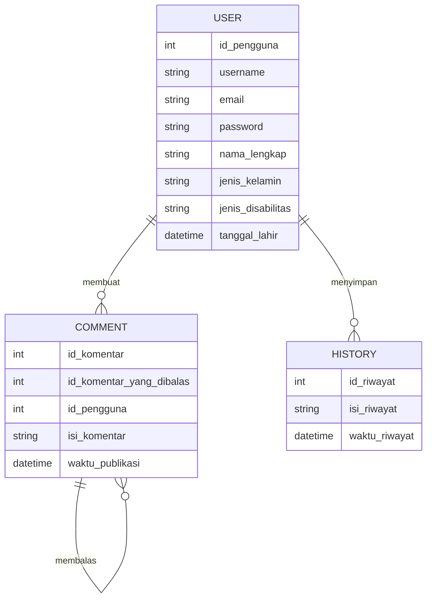
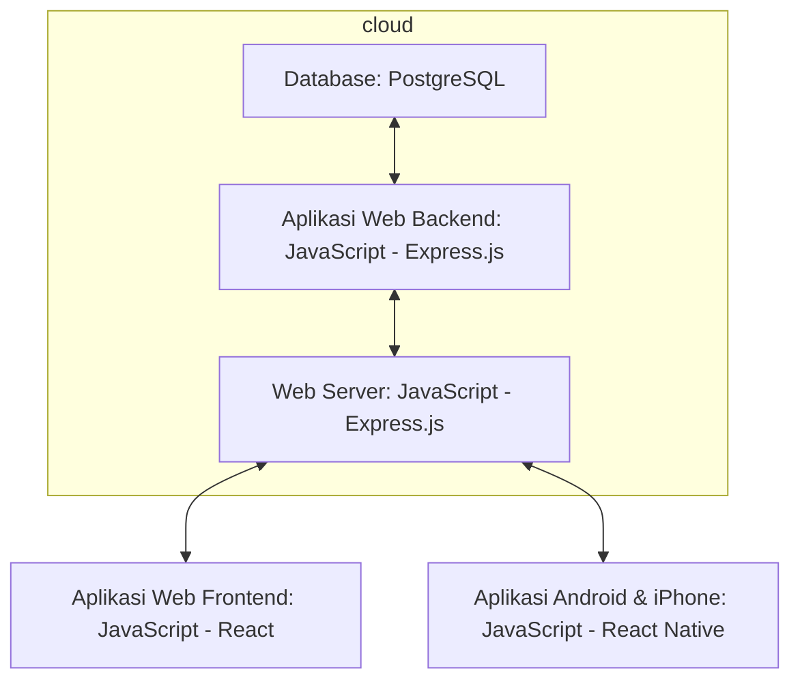

## 1.1 Latar Belakang

Penyandang disabilitas seringkali menghadapi kesulitan dalam berkomunikasi dan mengakses informasi, terutama jika mereka memiliki disabilitas sensorik atau kesulitan berbicara. Aksesibilitas komunikasi adalah hak asasi manusia yang penting, dan aplikasi seperti "Dishelper" sangat dibutuhkan untuk memberikan alat bantu yang dapat membantu memecahkan masalah ini.

## 1.2. Deksripsi Teknologi Informasi

Teknologi Informasi (TI) adalah sebuah konsep yang merujuk pada penggunaan berbagai jenis teknologi, termasuk perangkat keras (hardware), perangkat lunak (software), jaringan komunikasi, dan sistem informasi, untuk mengumpulkan, menyimpan, mengelola, memproses, dan mentransmisikan data dan informasi dalam berbagai konteks bisnis dan pribadi.

Adapun Dishelper adalah sebuah aplikasi yang dirancang untuk memberikan alat bantu dan dukungan teknologi kepada kaum disabilitas. Aplikasi ini bertujuan untuk mengatasi berbagai hambatan komunikasi yang dihadapi oleh penyandang disabilitas, seperti disabilitas sensorik atau kesulitan berbicara, dengan memberikan solusi berbasis teknologi, terutama berfokus pada fitur text-to-speech (TTS) dan voice-to-text (VTT), serta alat bantu lainnya.

## 1.3. Branding

- Merk    : DisHelper
- Tagline : Ada untuk membantu
- Campaign: Bagaimana membuat aplikasi yang dapat membantu dan merangkul mereka yang memiliki kekurangan fisik dalam beraktifitas dan berkomunikasi.
  
Target user:
- Usia 7+
- Seorang yang memiliki disabilitas sensorik atau kesulitan berbicara.
- Seorang yang membutuhkan alat bantu komunikasi portable.
- Seorang yang memerlukan informasi sarana ramah disabilitas.

User experience theme:
- Mudah
- Sederhana
- Warna: light blue 

## 2. User Story

Sebagai | Saya Ingin Bisa | Sehingga | Prioritas
---|---|---|---
Pengguna | Transcribe percakapan | dapat memahami apa yang orang ucapkan | ⭐⭐⭐⭐⭐
Pengguna | Text to speech | Membacakan apa yang saya ketik | ⭐⭐⭐⭐⭐
Pengguna | Mencari lokasi disekitar dengan fasilitas ramah disabilitas | Mendapat informasi mengenai fasilitas ramah disabilitas | ⭐⭐⭐⭐
Pengguna | Memberikan  mengenai lokasi dengan fasilitas ramah disabilitas | Dapat memberikan tanggapan | ⭐⭐⭐
Pengguna | Membalas Komentar | Dapat memberikan tanggapan | ⭐⭐⭐

## 3. Struktur Data

## 4. Arsitektur Sistem

## 5. Teknologi, Library, dan Framework

**Teknologi**
-Teknologi AI
-Teknologi Web
-Teknologi Database
-Teknologi Cloud Computing
-Teknologi Mobile
**Library**
-React
-Google Text-to-Speech/eSpeak
-Google Cloud Speech-to-Text/Rev
**Framework**
-Express js
-Next js
-React Native

Akan terus ditambahkan seiring masa development.

## 6. Desain User Experience dan User Interface

Masih dalam masa pengembangan....;(

## 7. Demonstrasi Video

https://youtu.be/SBmzYUaYZIc

## 8. Bagaimana mesin komputasi dan sistem operasi berperan dalam produk teknologi informasimu ?

https://youtu.be/SBmzYUaYZIc

## 9. Bagaimana algoritma, struktur data, dan bahasa pemrograman berperan dalam produk teknologi informasimu ?

https://youtu.be/SBmzYUaYZIc

## 10. Bagaimana metode pengembangan perangkat lunak / Software Development Life Cycle berperan dalam produk teknologi informasimu ?

https://youtu.be/SBmzYUaYZIc

 

## 11. Bagaimana database / sistem basis data berperan dalam produk teknologi informasimu ?

https://youtu.be/SBmzYUaYZIc
